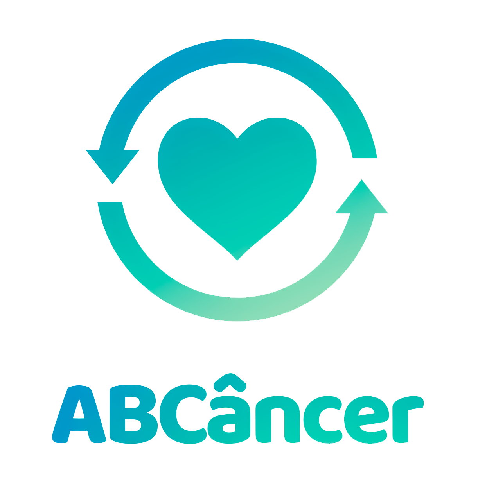
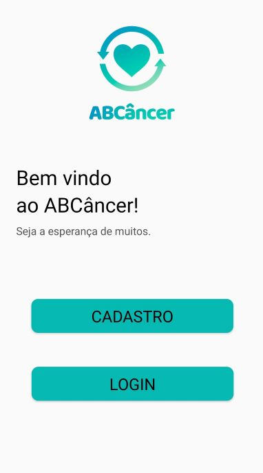

<!-- PROJECT LOGO -->
 

    
  </a>

  <h3 align="center">ABCâncer</h3>

  

    Repositório Mobile do projeto.
     
  

<!-- ABOUT THE PROJECT -->
## Sobre o projeto

 
Necessidade:
Devido ao período instável politicamente e economicamente que o Brasil vem vivendo, o que faz com que a população precise a cada dia mais da ajuda de terceiros. Segundo pesquisas, no início de 2020 apenas 50% dos entrevistados afirmaram ajudar ONGs, sendo que apenas 18% faziam doações em dinheiro, 38% em bens materiais, e 32% doaram outros tipos de serviços. Com o surgimento da pandemia da Covid-19, essas contribuições diminuíram exponencialmente. 

Objetivo:
Ajudar pessoas acometidas com os mais diversos tipos de câncer, de forma que sejam cadastrados voluntários aptos a ajudarem as instituições do modo que puderem, através de qualquer tipo de doações que as próprias instituições definirão se precisam.

Benefícios:
Aumentar a visibilidade das ONGs e o número de doações para que elas possam se manter financeiramente e apoiarem ainda mais as vítimas dos mais variados tipos de cânceres.

 

### Tecnologias

Aqui estão citadas algumas das principais tecnologias que estão sendo utilizadas para o desenvolvimento desse projeto.

* ![Java][Java.com]
* ![AndroidStudio][AndroidStudio.com]
* ![Android][Android.com]
* ![Firebase][Firebase.com]

 

<!-- CONTATO -->
## Contato

E-mail - vinicius.viturino@fatec.sp.gov.br

LinkedIn - https://www.linkedin.com/in/viniciusmazonviturino/

<!-- MARKDOWN LINKS & IMAGES -->
<!-- https://www.markdownguide.org/basic-syntax/#reference-style-links -->
[contributors-shield]: https://img.shields.io/github/contributors/othneildrew/Best-README-Template.svg?style=for-the-badge
[contributors-url]: https://github.com/FalaFatec/AMS-ADS-GR-4-DOC/graphs/contributors
[forks-shield]: https://img.shields.io/github/forks/othneildrew/Best-README-Template.svg?style=for-the-badge
[forks-url]: https://github.com/othneildrew/Best-README-Template/network/members
[stars-shield]: https://img.shields.io/github/stars/othneildrew/Best-README-Template.svg?style=for-the-badge
[stars-url]: https://github.com/othneildrew/Best-README-Template/stargazers
[issues-shield]: https://img.shields.io/github/issues/othneildrew/Best-README-Template.svg?style=for-the-badge
[issues-url]: https://github.com/othneildrew/Best-README-Template/issues
[license-shield]: https://img.shields.io/github/license/othneildrew/Best-README-Template.svg?style=for-the-badge
[license-url]: https://github.com/othneildrew/Best-README-Template/blob/master/LICENSE.txt
[linkedin-shield]: https://img.shields.io/badge/-LinkedIn-black.svg?style=for-the-badge&logo=linkedin&colorB=555
[linkedin-url]: https://linkedin.com/in/othneildrew
[product-screenshot]: images/screenshot.png
[Html.com]: https://img.shields.io/badge/HTML5-E34F26?style=for-the-badge&logo=html5&logoColor=white
[Css.com]: https://img.shields.io/badge/CSS3-1572B6?style=for-the-badge&logo=css3&logoColor=white
[Javascript.com]: https://img.shields.io/badge/JavaScript-323330?style=for-the-badge&logo=javascript&logoColor=F7DF1E
[Javascript-url]: https://www.javascript.com/
[Json.com]: https://img.shields.io/badge/json-5E5C5C?style=for-the-badge&logo=json&logoColor=white
[Json-url]: https://www.json.org/json-en.html
[Trello.com]: https://img.shields.io/badge/Trello-0052CC?style=for-the-badge&logo=trello&logoColor=white
[Trello-url]: https://trello.com/
[Postgre.com]: https://img.shields.io/badge/PostgreSQL-316192?style=for-the-badge&logo=postgresql&logoColor=white
[Postgre-url]: https://www.postgresql.org/
[Spring.com]: https://img.shields.io/badge/Spring-6DB33F?style=for-the-badge&logo=spring&logoColor=white
[Spring-url]: https://spring.io/projects/spring-boot
[Postman.com]: https://img.shields.io/badge/Postman-FF6C37?style=for-the-badge&logo=Postman&logoColor=white
[Postman-url]: https://www.postman.com/
[IntelliJ.com]: https://img.shields.io/badge/IntelliJ_IDEA-000000.svg?style=for-the-badge&logo=intellij-idea&logoColor=white
[IntelliJ-url]: https://www.jetbrains.com/idea/
[VisualStudioCode.com]: https://img.shields.io/badge/VSCode-0078D4?style=for-the-badge&logo=visual%20studio%20code&logoColor=white
[VisualStudioCode-url]: https://code.visualstudio.com/
[Bootstrap.com]: https://img.shields.io/badge/Bootstrap-563D7C?style=for-the-badge&logo=bootstrap&logoColor=white
[Java.com]: https://img.shields.io/badge/java-%23ED8B00.svg?style=for-the-badge&logo=java&logoColor=white
[AndroidStudio.com]: https://img.shields.io/badge/Android%20Studio-3DDC84.svg?style=for-the-badge&logo=android-studio&logoColor=white
[Android.com]: https://img.shields.io/badge/Android-3DDC84?style=for-the-badge&logo=android&logoColor=white
[Firebase.com]: https://img.shields.io/badge/firebase-ffca28?style=for-the-badge&logo=firebase&logoColor=black
